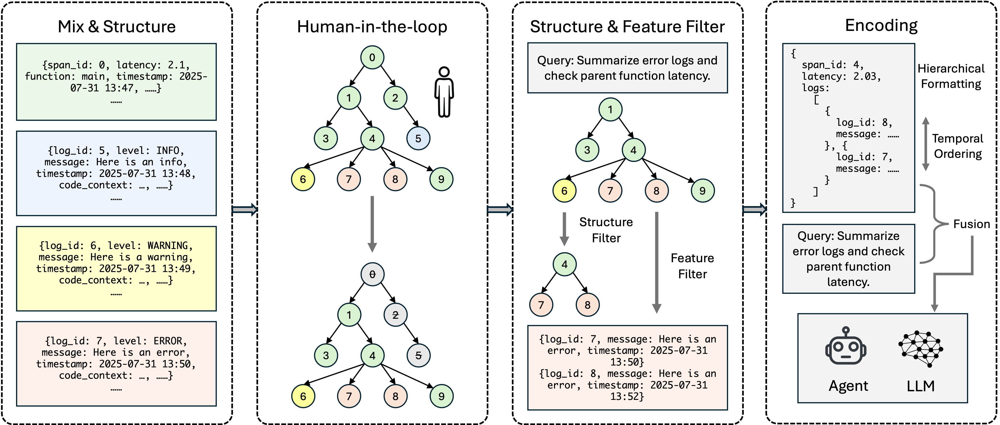

<div align="center">
  <a href="https://traceroot.ai/">
    
  </a>
</div>

<div align="center">

[![Testing Status][testing-image]][testing-url]
[![Documentation][docs-image]][docs-url]
[![Discord][discord-image]][discord-url]
[![PyPI Version][pypi-image]][pypi-url]
[![PyPI SDK Downloads][pypi-sdk-downloads-image]][pypi-sdk-downloads-url]
[![npm version][npm-image]][npm-url]
[![TraceRoot.AI Website][company-website-image]][company-website-url]
[![X][company-x-image]][company-x-url]
[![X][zecheng-x-image]][zecheng-x-url]
[![X][xinwei-x-image]][xinwei-x-url]
[![LinkedIn][company-linkedin-image]][company-linkedin-url]
[![WhatsApp][company-whatsapp-image]][company-whatsapp-url]
[![Wechat][wechat-image]][wechat-url]

</div>

<div align="center">

**TraceRoot is an open-source debugging platform that helps engineers fix production issues 10x faster by combining structured traces, logs, and source code context with AI-powered analysis.**

</div>

<div align="center">
<h4 align="center">

[Contributing](CONTRIBUTING.md) |
[TraceRoot.AI](https://traceroot.ai/) |
[Community](https://discord.gg/tPyffEZvvJ) |
[SDK](https://github.com/traceroot-ai/traceroot-sdk) |
[Documentation](https://docs.traceroot.ai)

</h4>

Join us ([*Discord*](https://discord.gg/tPyffEZvvJ)) in pushing the boundaries of debugging with AI agents.

Please 🌟 Star TraceRoot on GitHub and be instantly notified of new releases.

</div>

## TraceRoot Framework Design Principles

<h3>🤖 Intelligence</h3 >

The framework enables multi-agent systems to continuously evolve by interacting with environments.

<h3>⏰ Real-Time</h3 >

The framework enables real-time tracing and logging to your applications.

<h3>🧠 Structured Information</h3 >

The framework enables utilizing structured loggings and tracing data to improve the performance of AI agents.

<h3>💻 Integration</h3 >

The framework enables integrating with other sources and tools, such as GitHub, Notion, etc. This provides a seamless experience for you to use the framework in your applications.

<h3>😊 Developer Friendly</h3 >

We also provide a Cursor like interface but specialized for debugging and tracing. You can select the logs and traces you are interested in and ask the framework to help you with the analysis.

## Why Use TraceRoot for Your Applications?

We are a community-driven collective comprising over multiple engineers and researchers dedicated to advancing frontier engineering and research in using Multi-Agent Systems to help not only human but also AI agents on debugging, tracing, and root cause analysis.

<table style="width: 100%;">

<tr>
    <td align="left">✅</td>
    <td align="left" style="font-weight: bold;">Multi-Agent System</td>
    <td align="left">Multi-Agent system that can be used to solve complex tasks.</td>
  </tr>
  <tr>
    <td align="left">✅</td>
    <td align="left" style="font-weight: bold;">Real-Time Tracing and Logging</td>
    <td align="left">Enable real-time tracing and logging to your applications.</td>
  </tr>
  <tr>
    <td align="left">✅</td>
    <td align="left" style="font-weight: bold;">Structured Logging</td>
    <td align="left">Enable structured logging to your applications, which allows better performance of AI agents.</td>
  </tr>
  <tr>
    <td align="left">✅</td>
    <td align="left" style="font-weight: bold;">Integration with Multiple Resources</td>
    <td align="left">Integrate with other sources and tools, such as GitHub, Notion, etc.</td>
  </tr>
  <tr>
    <td align="left">✅</td>
    <td align="left" style="font-weight: bold;">Developer Friendly</td>
    <td align="left">We provide a Cursor like interface but specialized for debugging and tracing.</td>
  </tr>
</table>

## AI Agent Framework

Here is an overview for our AI Agent Framework:

### Context Model

<div align="center">
  <a href="https://traceroot.ai/">
    
  </a>
</div>

### Chunking

### Explainability

Please checkout the [README.md in the `rest/agent` directory](rest/agent/README.md) for more details.

## Getting started with TraceRoot

### TraceRoot Cloud (Recommended)

The fastest and most reliable way to get started with TraceRoot is signing up
for free to [TraceRoot Cloud](https://auth.traceroot.ai/) for a 7 day trial.
You will have 150k trace + logs storage with 30d retentions, 1.5M LLM tokens,
and AI agent with chat mode.

### Self-hosting the open-source deploy (Advanced)

#### Installation

You can install the latest version of TraceRoot with the following command:

Install the dependencies locally:

```bash
git clone https://github.com/traceroot-ai/traceroot.git
cd traceroot

# Create and activate a virtual environment
python3.11 -m venv venv
source venv/bin/activate

# Install TraceRoot with dependencies excluding optional dependencies
pip install --upgrade pip
pip install -e .
```

#### Local Usage

For local usage, all of your data will be stored locally.

Run the below command to intialize environment variables.

```bash
source .env.development
```

You can use the TraceRoot framework locally by following the [README.md in the `ui` directory](ui/README.md) and [README.md in the `rest` directory](rest/README.md).

Also, you can build the latest docker image and run the docker container by following the [README.md in the `docker` directory](docker/public/README.md).

This will start the UI at [http://localhost:3000](http://localhost:3000) and the API at [http://localhost:8000](http://localhost:8000).

Before using the TraceRoot framework, you need to setup the Jaeger docker container at first. It will be used to store the traces and logs and capture the traces and logs from our SDK which is integrated with your applications.

```bash
docker run -d --name jaeger \
  -e COLLECTOR_OTLP_ENABLED=true \
  -p 16686:16686 \
  -p 14268:14268 \
  -p 14250:14250 \
  -p 4317:4317 \
  -p 4318:4318 \
  cr.jaegertracing.io/jaegertracing/jaeger:2.8.0
```

In local mode, the first step is to go to the integration page and connect with your GitHub account (optional) with your GitHub token.
You also need to put your OpenAI API key in the integration page.

## Setting up TraceRoot

Our project is built on top of the TraceRoot SDK. You need to use our SDK to integrate with your applications by

```bash
pip install traceroot==0.0.4a7
```

To use the local mode of the TraceRoot SDK, you need create a `.traceroot-config.yaml` file in the root directory of your project with following content:

```yaml
local_mode: true
service_name: "your-service-name"
github_owner: "your-github-owner"
github_repo_name: "your-github-repo-name"
github_commit_hash: "your-github-commit-hash"
```

As mentioned above, you need to setup the Jaeger docker container at first before let the TraceRoot SDK capture the traces and logs from your applications.

For more details or the SDK usage and examples, please checkout this [Quickstart](https://docs.traceroot.ai/quickstart).

## Citation

If you find our exploratory TraceRoot useful in your research, please consider citing:

```bibtex
@article{traceroot_2025,
  title={TraceRoot Is All You Need for Debugging and Tracing},
  author={Zecheng Zhang and Xinwei He},
  year = {2025},
  publisher = {GitHub},
  url = {https://github.com/traceroot-ai/traceroot}
}
```

[company-linkedin-image]: https://custom-icon-badges.demolab.com/badge/LinkedIn-0A66C2?logo=linkedin-white&logoColor=fff
[company-linkedin-url]: https://www.linkedin.com/company/traceroot-ai/
[company-website-image]: https://img.shields.io/badge/website-traceroot.ai-148740
[company-website-url]: https://traceroot.ai
[company-whatsapp-image]: https://img.shields.io/badge/WhatsApp-25D366?logo=whatsapp&logoColor=white
[company-whatsapp-url]: https://chat.whatsapp.com/GzBii194psf925AEBztMir
[company-x-image]: https://img.shields.io/twitter/follow/TracerootAI?style=social
[company-x-url]: https://x.com/TracerootAI
[discord-image]: https://img.shields.io/discord/1395844148568920114?logo=discord&labelColor=%235462eb&logoColor=%23f5f5f5&color=%235462eb
[discord-url]: https://discord.gg/tPyffEZvvJ
[docs-image]: https://img.shields.io/badge/docs-traceroot.ai-0dbf43
[docs-url]: https://docs.traceroot.ai
[npm-image]: https://img.shields.io/npm/v/traceroot-sdk-ts?style=flat-square&logo=npm&logoColor=fff
[npm-url]: https://www.npmjs.com/package/traceroot-sdk-ts
[pypi-image]: https://badge.fury.io/py/traceroot.svg
[pypi-sdk-downloads-image]: https://img.shields.io/pypi/dm/traceroot
[pypi-sdk-downloads-url]: https://pypi.python.org/pypi/traceroot
[pypi-url]: https://pypi.python.org/pypi/traceroot
[testing-image]: https://github.com/traceroot-ai/traceroot/actions/workflows/test.yml/badge.svg
[testing-url]: https://github.com/traceroot-ai/traceroot/actions/workflows/test.yml
[wechat-image]: https://img.shields.io/badge/WeChat-TraceRoot.AI-brightgreen?logo=wechat&logoColor=white
[wechat-url]: https://raw.githubusercontent.com/traceroot-ai/traceroot/refs/heads/main/misc/images/wechat.jpg
[xinwei-x-image]: https://img.shields.io/twitter/follow/xinwei_97?style=social
[xinwei-x-url]: https://x.com/xinwei_97
[zecheng-x-image]: https://img.shields.io/twitter/follow/zechengzh?style=social
[zecheng-x-url]: https://x.com/zechengzh
